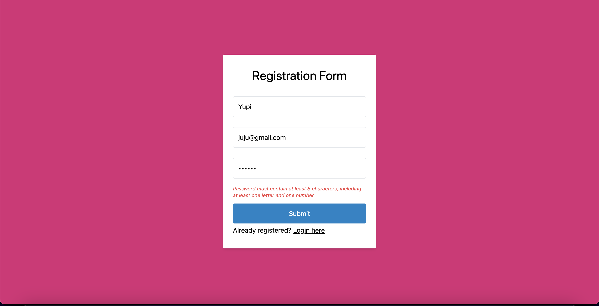

# Week 19 Assignment (React Page with Vite + TS )

For this week's assignment, I'm building a front-end website using React for pet-salon.

## Links

[gae-petssalon.meselghea.site](https://gae-petssalon.meselghea.site/)

## feature

- Groomers can register.
- Groomers can log in.
- Pet owners can view the status of their pet's grooming on a monitor in the waiting room or on the website.
- Pet owners is able to filter by his or her name.
- Groomer able to create the pet list.
- Groomer able to update the pet list.
- Groomer able to remove pet from the list.
- Implementing Styling (Tailwind CSS)
- Generate a token by multiplying UUID4 x 3, user ID, and a 12-hour expired token in session storage.
- Implementing validation registration and login forms with react-hook-form.

## Quick Start

1. Open [gae-petssalon.meselghea.site](https://gae-petssalon.meselghea.site/)
2. Click the Admin button in the top right corner of the page
3. Login with groomer account
   `username: "Admin"
password: "Ad123min"`
4. Now you can explore the dashboard!

##

